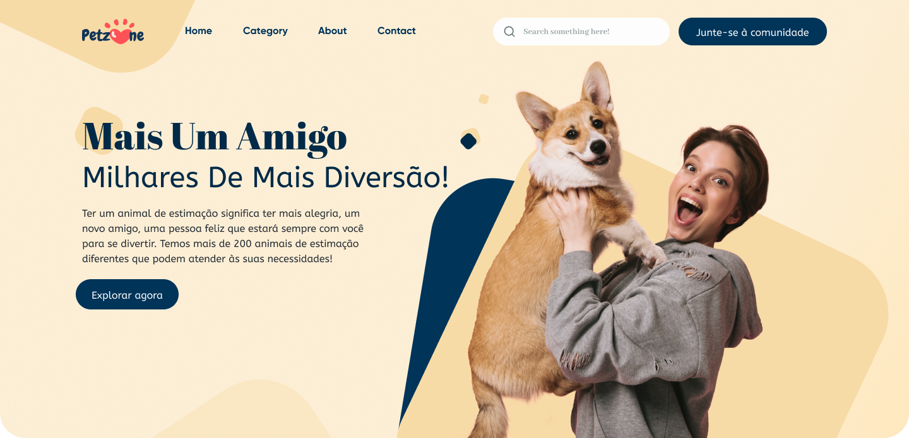

<h1 align="center">Olho Alerta - Front-End</h1>

<h1 align="center">
    
</h1>

## Tecnologias 🚀

- [NextJs](https://vitejs.dev/)

## 📖 Sobre
Petzone é um site de adoção de cachorro desenvolvido para o porojeto final dos alunos de Back-End Senai. 

Esta aplicação foi desenvolvida para as aulas de Back-End do Firjan Senai dias 5 a 11 de Abril de 2024.

